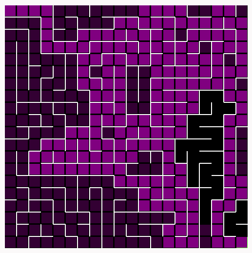

# Maze Generator

**Conteúdo da Disciplina**: Grafos 1 

## Alunos

| Matrícula  | Aluno        |
| ---------- | ------------ |
| 18/0074741 | Caio Martins |
| 18/0105345 | Lucas Lima   |

## Sobre

Demonstra a construção de um labirinto utilizando o algoritmo DFS. E sua travessia pelo algoritmo BSF

## Apresentação

A apresentação esta localizada na pasta video.

## Screenshots

## Instalação

**Linguagem**: JavaScript 

## Uso

-   Abra o arquivo index.html localizado em src/index.html em seu navegador

## Outros

Referência do projeto [Link](https://www.youtube.com/watch?v=nHjqkLV_Tp0)
